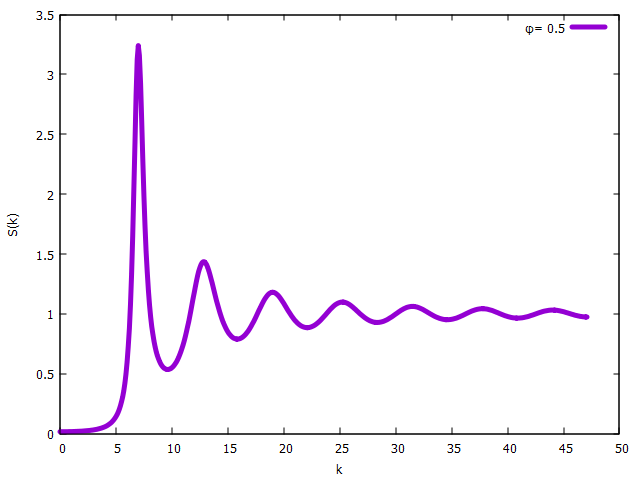
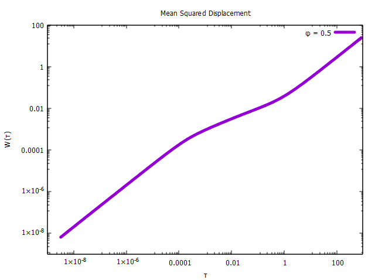
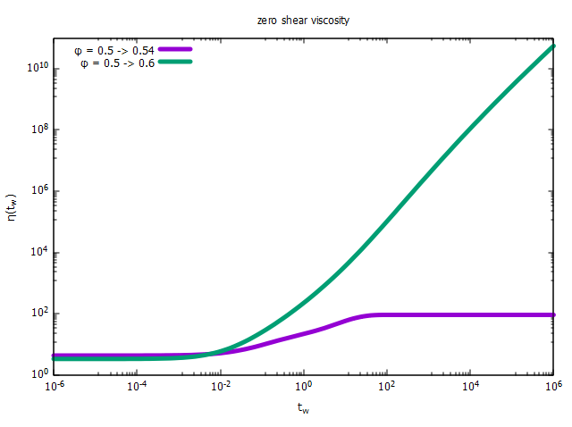

# NESCGLE.jl project

In this simple repository written in [Julia](https://julialang.org/) you can find a set of routines created so that any kind of user new to liquid theory will be able to evaluate the equations of the NE-SCGLE.

All the code works through APIs and is very easy to use.

## Static structure factor

Inside a file with `.jl` ending type the following
```julia
include("src/API.jl")

# Input_HS(ϕ :: Float64, k :: Array{Float64}; VW = false :: Bool)
k = collect(0.0:0.1:15*π)
ϕ = 0.5
I = Input_HS(ϕ, k)
S = structure_factor(I)
save_data("sdk.dat", [k S])
```
and run it in Julia's terminal as follows
```
julia> include("name_of_your_script.jl");
Data saved as sdk.dat
```
as a result you will get a `.dat` file that you can plot with tools like [gnuplot](http://www.gnuplot.info/). For example, if we type inside the gnuplot environment
```gnuplot
gnuplot> #set encoding utf8
gnuplot> set title "Static structure factor"
gnuplot> set xlabel "k"
gnuplot> set ylabel "S(k)"
gnuplot> plot "sdk.dat" w l t "{/Symbol f}= 0.5"
```
The result will be



## Equilibrium Dynamics

The static structure factor is the main input to solve the equations of the theory. For this, we simply write in our script:
```julia
τ, Fs, F, Δζ, Δη, D, W = SCGLE(I)

save_data("Eq_Dynamics.dat", [τ Fs F Δζ Δη D W])
```
after some processing time we obtain microscopic quantities such as the intermediate scattering function, the mean square displacement, the diffusion coefficient or even the shear relaxation viscosity. 
By example, we can plot the mean squared displacemen as

```gnuplot
gnuplot> set title "Mean Squared Displacement"
gnuplot> set xlabel "{/Symbol t}"
gnuplot> set ylabel "W({/Symbol t})"
gnuplot> set logscale
gnuplot> plot "Eq_Dynamics.dat" u 1:7 w l lw 5 t "{/Symbol f} = 0.5"
```



## Non-Equilibrium Dynamics

Unlike a state of thermodynamic equilibrium, a system out of equilibrium needs a collection of parameters that represent the initial and final configuration.
Additionally, we need to specify the process preparation protocol. We currently have three types of processes: instantaneous processes and processes with finite cooling.
So, for a compression of hard spheres we need to write:
```julia
k = collect(0.0:0.1:15*π)
ϕⁱ = 0.5
ϕᶠ = 0.6
I = Input_HS(ϕⁱ, k)
F = Input_HS(ϕᶠ, k)
InstantaneousProcess(I, F)
```
In your terminal, you will find information about the status of the process:
```
     0xlccoxkO0K
   kl;''''';okkkOK      #  ### #  # # #   # ### ###
 Oc,''''''''l00kkkkx0   #  # # ## # # ## ## #   #
k;''''''',:oK  XOkkl:O  #  ### # ## # # # # ##  ##
:'''',cdk0X     Kkx:'cK ## # # #  # # #   # #   ###
''',ck          Xkl,',k
'',lOX          kc,'';k Laboratorio Nacional de la
:'cxkK     X0Odc,''''cK Ingeniería de la Materia
k:lkkOX  0o:,''''''':O  Fuera del Equilibrio
 Oxkkkk00c'''''''',l0
   XKOkkko;''''';lO     HandsOn NE-SCGLE Version 0.02
      KOOkxlccld0       (11-05-2023)
Start
index = 0, tw = 0.0
index = 1, tw = 1.0e-6
index = 2, tw = 1.2589254117941672e-6
index = 3, tw = 1.5848931924611134e-6
...
index = 119, tw = 630957.3444801943
index = 120, tw = 794328.234724282
index = 121, tw = 1.0e6
```
A collection of files is created in the path ```\HardSphere\vfi0p5vff0p6\``` with al the data generated.
Something we can plot without any further analysis is the bulk viscosity of our compression.
```gnuplot
gnuplot> set title "zero shear viscosity"
gnuplot> set xlabel "t_w"
gnuplot> set ylabel "{/Symbol h}(t_w)"
gnuplot> set logscale
gnuplot> set format "10^{%L}"
gnuplot> set key top left
gnuplot> plot "HardSphere/vfi0p5phif0p6/instantaneous_process.dat" u 2:(1+$6) w l lw 5 t "{/Symbol f} = 0.5 -> 0.6"
```



In this graph we observe a process of equilibration and one of aging.
